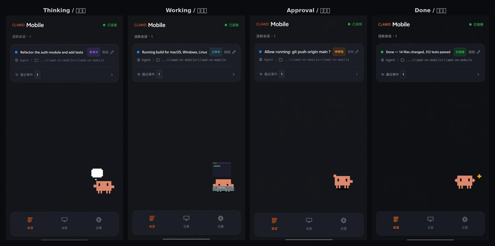

<p align="center">
  
</p>

<h1 align="center">Clawd Mobile</h1>
<p align="center">
  <strong><a href="https://github.com/rullerzhou-afk/clawd-on-desk">Clawd on Desk</a> の Android コンパニオンアプリ — AI コーディングエージェントにリアルタイムで反応するサイバーパンクなデスクトップペット。</strong>
</p>

<p align="center">
  <a href="README.md">English</a>
  ·
  <a href="README.zh-CN.md">简体中文</a>
  ·
  <a href="README.zh-TW.md">繁體中文</a>
  ·
  <a href="README.ko-KR.md">한국어</a>
  ·
  <a href="README-desk.md">Desktop Version</a>
</p>

<p align="center">
  <a href="https://github.com/Bynlk/clawd-on-mobile/actions/workflows/android.yml"></a>
  <a href="LICENSE"></a>
  <a href="https://github.com/Bynlk/clawd-on-mobile/releases"></a>
  
  
</p>

<p align="center">
  
</p>

<p align="center">
  <sub>ペットがリアルタイムで反応 — <b>Thinking</b> · <b>Working</b> · <b>Approval</b> · <b>Done</b></sub>
</p>

---

> **🙏 原作者への敬意**
>
> 本プロジェクトは [rullerzhou-afk/clawd-on-desk](https://github.com/rullerzhou-afk/clawd-on-desk)（Clawd on Desk）デスクトップ版をベースに開発されています。オリジナルは [@rullerzhou-afk](https://github.com/rullerzhou-afk)（鹿鹿 / Ruller_Lulu）が作成した、あなたのデスクトップに住み AI コーディングエージェントの一挙一動を感じ取る小さなカニです。
>
> Android 版はコミュニティ開発者 [@Bynlk](https://github.com/Bynlk) が移植・保守しています。プロジェクトに貢献してくださったすべての[開発者](#-貢献者)に感謝します。

---

## 📖 目次

- [Clawd Mobile とは？](#-clawd-mobile-とは)
- [機能](#-機能)
- [スクリーンショット](#-スクリーンショット)
- [クイックスタート](#-クイックスタート)
- [アーキテクチャ](#-アーキテクチャ)
- [通信プロトコル](#-通信プロトコル)
- [開発](#-開発)
- [コントリビュート](#-コントリビュート)
- [今後の機能](#-今後の機能)
- [ロードマップ](#-ロードマップ)
- [FAQ](#-faq)
- [貢献者](#-貢献者)
- [ライセンス](#-ライセンス)
- [謝辞](#-謝辞)

---

## 🐾 Clawd Mobile とは？

**Clawd Mobile** は、[Clawd on Desk](https://github.com/rullerzhou-afk/clawd-on-desk) デスクトップペットに接続するネイティブ Android クライアントです。**LAN またはリモートリレー** 経由で AI コーディングエージェントの活動をリアルタイムに監視し、エージェントの動きに反応するアニメーションペットをスマホ画面に表示します。

| 特徴 | 仕組み | 体験 |
|------|--------|------|
| **ミリ秒級の状態同期** | WebSocket + `StateFlow` パイプライン、遅延 < 200ms | エージェントと同時にカニが入力を始める |
| **純粋なキャラクター分離** | サーバー側 `displayState` + `PetStateManager` エンジン | 3 キャラクター（カニ/三毛猫/雲）が独立した状態マッピング |
| **超低消費電力** | `WifiLock` + `WakeLock` + 30 秒ウォッチドッグ + 指数バックオフ（1s→30s） | バックグラウンド消費電力 < 50mW、一日中稼働 |
| **オーバーレイ承認** | フローティングバブル上でスワイプして権限リクエストを承認 | アプリを開く必要なし |
| **リモートリレー** | VPS リレー経由で非 LAN 環境でも接続 | どこからでもエージェントを監視 |

---

## ✨ 機能

### コア体験
- 🐾 **アニメーションするフローティングペット** — SVG/APNG + CSS アニメーション（呼吸、まばたき、尻尾振り）
- 📱 **16 種類の状態** — Working、Thinking、Idle、Sleeping、Error、Notification など
- 🎯 **スマートな睡眠シーケンス** — Yawning → Dozing → Collapsing → Sleeping + ランダムな idle バリエーション
- 🏆 **お祝いアニメーション** — タスク完了時に 1.5 秒のアニメーションを再生

### v0.10.0 — 最新リリース
- 🐾 **オーバーレイ承認バブル** — フローティングバブル上のスワイプで権限リクエストを承認/拒否
- 🌐 **リモートリレー** — VPS リレーサーバー経由で非 LAN 環境をサポート
- 🌍 **アプリ内言語切り替え** — 中国語/英語を再起動なしで切り替え
- 🔒 **セキュリティ強化** — 暗号化ストレージ、TOFU 証明書ピンニング、ログ除去
- 🧪 **548 個のテスト** — すべて通過、103 個の新規テストを追加

---

## 📸 スクリーンショット

> _スクリーンショットは近日公開。アプリはスマホ画面にアニメーションするペットを表示し、AI エージェントの活動——考え中、作業中、承認待ち、タスク完了時のお祝い——にリアルタイムで反応します。_

| フローティングペット | 承認バブル | 設定 |
|:---:|:---:|:---:|
| _スクリーンショット_ | _スクリーンショット_ | _スクリーンショット_ |

---

## ⚡ クイックスタート

### 前提条件
- Android 8.0+ (API 26)、arm64-v8a 対応デバイス
- PC で [Clawd on Desk](https://github.com/rullerzhou-afk/clawd-on-desk) が動作していること

### インストール

1. [Releases](https://github.com/Bynlk/clawd-on-mobile/releases) から最新の `app-release.apk` をダウンロード
2. Android デバイスに APK をインストール
3. アプリを開き、PC に表示された QR コードをスキャンするか、接続情報を手動入力
4. 要求された権限（通知、カメラ、オーバーレイ）を許可
5. ペットが起動しました！🎉

### 接続方法

| 方法 | 使う場面 |
|------|---------|
| **QR コードスキャン** | PC とスマホが同じ LAN — 最速 |
| **手動入力** | PC の IP、ポート、トークンを手動入力 |
| **リモートリレー** | VPS リレー経由で非 LAN 環境に接続 |

---

## 🏛️ アーキテクチャ

Clawd Mobile は、すべての状態変更が 1 本の統一された `StateFlow` を流れる**シングルパイプアーキテクチャ**を採用しています:

```
PC (WebSocket) → StreamingClient → PetStateManager → FloatingPetService
                                          ↓
                                    StateCommand (シングルパイプ)
                                          ↓
                              SvgLoader → FloatingPetView (WebView SVG)
```

**主要な設計判断:**
- **シングルパイプ** — 並行 SVG ロードの競合を排除
- **テンプレートメソッドパターン**（`StreamingClient` → `AbstractStreamingClient` → `WsClient`）— トランスポート拡張が容易
- **ストラテジーパターン**（`ConnectionStrategy`）— LAN/Relay 接続を疎結合化
- **SessionMerger** — LAN + Relay セッションを 1 つのビューに統一

詳細なアーキテクチャドキュメントは [android/README.md](android/README.md) を参照してください。

---

## 📡 通信プロトコル

```
WebSocket:  ws://<host>:23334/mobile/ws
承認:       POST http://<host>:23334/mobile/approve
Deep Link:  clawd://<host>:<port>/<token>
```

| メッセージタイプ | 方向 | 説明 |
|-------------|------|------|
| `ping` | サーバー → クライアント | ハートビート |
| `connected` | サーバー → クライアント | 接続確認 |
| `snapshot` | サーバー → クライアント | 全セッションリスト |
| `state` | サーバー → クライアント | 単一セッション更新 |
| `permission_request` | サーバー → クライアント | 承認リクエスト |
| `reaction` | サーバー → クライアント | SVG リアクションアニメーション |

---

## 🔧 開発

### 環境
- Android Studio Hedgehog (2023.1.1)+
- JDK 17
- Android SDK 35
- arm64-v8a デバイスまたはエミュレーター

### ビルド

```bash
cd android

# Debug APK
./gradlew assembleDebug

# Release APK（署名設定が必要）
KEYSTORE_FILE=release.keystore \
STORE_PASSWORD=xxx \
KEY_ALIAS=clawd \
KEY_PASSWORD=xxx \
./gradlew assembleRelease

# テスト実行（548 個のテスト）
./gradlew testDebugUnitTest
```

### CI/CD

`android/` 配下の変更を含む `main` への push で GitHub Actions が起動:lint → build → test → artifact アップロード。

---

## 🤝 コントリビュート
Clawd on Mobile は [Clawd on Desk](https://github.com/rullerzhou-afk/clawd-on-desk) をベースにした二次創作プロジェクトで、デスクトップ版に Android コンパニオンアプリ、オーバーレイ承認、リモートリレーなどの機能を追加しています。

本プロジェクトへの貢献は [CONTRIBUTING.md](./CONTRIBUTING.md) を参照してください。

バグ報告、機能提案、プルリクエストを歓迎します — [issue](https://github.com/Bynlk/clawd-on-mobile/issues) を立てて議論するか、直接 PR を送ってください。

### メンテナー

<table>
  <tr>
    <td align="center" valign="top" width="140"><a href="https://github.com/rullerzhou-afk"><br /><sub><b>@rullerzhou-afk</b><br />鹿鹿 · creator</sub></a></td>
    <td align="center" valign="top" width="140"><a href="https://github.com/YOIMIYA66"><br /><sub><b>@YOIMIYA66</b><br />maintainer</sub></a></td>
    <td align="center" valign="top" width="140"><a href="https://github.com/Bynlk"><br /><sub><b>@Bynlk</b><br />core contributor · Mobile / PWA</sub></a></td>
  </tr>
</table>

### 貢献者

Clawd をより良くしてくれたすべての方に感謝します:

<table>
  <tr>
    <td align="center" valign="top" width="110"><a href="https://github.com/PixelCookie-zyf"><br /><sub>PixelCookie-zyf</sub></a></td>
    <td align="center" valign="top" width="110"><a href="https://github.com/yujiachen-y"><br /><sub>yujiachen-y</sub></a></td>
    <td align="center" valign="top" width="110"><a href="https://github.com/AooooooZzzz"><br /><sub>AooooooZzzz</sub></a></td>
    <td align="center" valign="top" width="110"><a href="https://github.com/purefkh"><br /><sub>purefkh</sub></a></td>
    <td align="center" valign="top" width="110"><a href="https://github.com/Tobeabellwether"><br /><sub>Tobeabellwether</sub></a></td>
    <td align="center" valign="top" width="110"><a href="https://github.com/Jasonhonghh"><br /><sub>Jasonhonghh</sub></a></td>
    <td align="center" valign="top" width="110"><a href="https://github.com/crashchen"><br /><sub>crashchen</sub></a></td>
  </tr>
  <tr>
    <td align="center" valign="top" width="110"><a href="https://github.com/hongbigtou"><br /><sub>hongbigtou</sub></a></td>
    <td align="center" valign="top" width="110"><a href="https://github.com/InTimmyDate"><br /><sub>InTimmyDate</sub></a></td>
    <td align="center" valign="top" width="110"><a href="https://github.com/NeizhiTouhu"><br /><sub>NeizhiTouhu</sub></a></td>
    <td align="center" valign="top" width="110"><a href="https://github.com/xu3stones-cmd"><br /><sub>xu3stones-cmd</sub></a></td>
    <td align="center" valign="top" width="110"><a href="https://github.com/Ye-0413"><br /><sub>Ye-0413</sub></a></td>
    <td align="center" valign="top" width="110"><a href="https://github.com/WanfengzzZ"><br /><sub>WanfengzzZ</sub></a></td>
    <td align="center" valign="top" width="110"><a href="https://github.com/androidZzT"><br /><sub>androidZzT</sub></a></td>
  </tr>
  <tr>
    <td align="center" valign="top" width="110"><a href="https://github.com/TaoXieSZ"><br /><sub>TaoXieSZ</sub></a></td>
    <td align="center" valign="top" width="110"><a href="https://github.com/ssly"><br /><sub>ssly</sub></a></td>
    <td align="center" valign="top" width="110"><a href="https://github.com/stickycandy"><br /><sub>stickycandy</sub></a></td>
    <td align="center" valign="top" width="110"><a href="https://github.com/Rladmsrl"><br /><sub>Rladmsrl</sub></a></td>
    <td align="center" valign="top" width="110"><a href="https://github.com/YOIMIYA66"><br /><sub>YOIMIYA66</sub></a></td>
    <td align="center" valign="top" width="110"><a href="https://github.com/Kevin7Qi"><br /><sub>Kevin7Qi</sub></a></td>
    <td align="center" valign="top" width="110"><a href="https://github.com/sefuzhou770801-hub"><br /><sub>sefuzhou770801-hub</sub></a></td>
  </tr>
  <tr>
    <td align="center" valign="top" width="110"><a href="https://github.com/Tonic-Jin"><br /><sub>Tonic-Jin</sub></a></td>
    <td align="center" valign="top" width="110"><a href="https://github.com/seoki180"><br /><sub>seoki180</sub></a></td>
    <td align="center" valign="top" width="110"><a href="https://github.com/sophie-haynes"><br /><sub>sophie-haynes</sub></a></td>
    <td align="center" valign="top" width="110"><a href="https://github.com/PeterShanxin"><br /><sub>PeterShanxin</sub></a></td>
    <td align="center" valign="top" width="110"><a href="https://github.com/CHIANGANGSTER"><br /><sub>CHIANGANGSTER</sub></a></td>
    <td align="center" valign="top" width="110"><a href="https://github.com/JaeHyeon-KAIST"><br /><sub>JaeHyeon-KAIST</sub></a></td>
    <td align="center" valign="top" width="110"><a href="https://github.com/hhhzxyhhh"><br /><sub>hhhzxyhhh</sub></a></td>
  </tr>
  <tr>
    <td align="center" valign="top" width="110"><a href="https://github.com/TVpoet"><br /><sub>TVpoet</sub></a></td>
    <td align="center" valign="top" width="110"><a href="https://github.com/zeus6768"><br /><sub>zeus6768</sub></a></td>
    <td align="center" valign="top" width="110"><a href="https://github.com/anhtrinh919"><br /><sub>anhtrinh919</sub></a></td>
    <td align="center" valign="top" width="110"><a href="https://github.com/tomaioo"><br /><sub>tomaioo</sub></a></td>
    <td align="center" valign="top" width="110"><a href="https://github.com/v-avuso"><br /><sub>v-avuso</sub></a></td>
    <td align="center" valign="top" width="110"><a href="https://github.com/livlign"><br /><sub>livlign</sub></a></td>
    <td align="center" valign="top" width="110"><a href="https://github.com/tongguang2"><br /><sub>tongguang2</sub></a></td>
  </tr>
  <tr>
    <td align="center" valign="top" width="110"><a href="https://github.com/Ziy1-Tan"><br /><sub>Ziy1-Tan</sub></a></td>
    <td align="center" valign="top" width="110"><a href="https://github.com/tatsuyanakanogaroinc"><br /><sub>tatsuyanakanogaroinc</sub></a></td>
    <td align="center" valign="top" width="110"><a href="https://github.com/yeonhub"><br /><sub>yeonhub</sub></a></td>
    <td align="center" valign="top" width="110"><a href="https://github.com/joshua-wu"><br /><sub>joshua-wu</sub></a></td>
    <td align="center" valign="top" width="110"><a href="https://github.com/nmsn"><br /><sub>nmsn</sub></a></td>
    <td align="center" valign="top" width="110"><a href="https://github.com/sunnysonx"><br /><sub>sunnysonx</sub></a></td>
    <td align="center" valign="top" width="110"><a href="https://github.com/YuChenYunn"><br /><sub>YuChenYunn</sub></a></td>
  </tr>
  <tr>
    <td align="center" valign="top" width="110"><a href="https://github.com/jhseo-b"><br /><sub>jhseo-b</sub></a></td>
    <td align="center" valign="top" width="110"><a href="https://github.com/Hwasowl"><br /><sub>Hwasowl</sub></a></td>
    <td align="center" valign="top" width="110"><a href="https://github.com/XiangZheng2002"><br /><sub>XiangZheng2002</sub></a></td>
    <td align="center" valign="top" width="110"><a href="https://github.com/keiyo118"><br /><sub>keiyo118</sub></a></td>
    <td align="center" valign="top" width="110"><a href="https://github.com/pan93412"><br /><sub>pan93412</sub></a></td>
    <td align="center" valign="top" width="110"><a href="https://github.com/taehwanis"><br /><sub>taehwanis</sub></a></td>
    <td align="center" valign="top" width="110"><a href="https://github.com/linnin233"><br /><sub>linnin233</sub></a></td>
  </tr>
  <tr>
    <td align="center" valign="top" width="110"><a href="https://github.com/xiyouMc"><br /><sub>xiyouMc</sub></a></td>
    <td align="center" valign="top" width="110"><a href="https://github.com/Bynlk"><br /><sub>Bynlk</sub></a></td>
    <td align="center" valign="top" width="110"><a href="https://github.com/zxypro1"><br /><sub>zxypro1</sub></a></td>
    <td align="center" valign="top" width="110"><a href="https://github.com/NeroAyase"><br /><sub>NeroAyase</sub></a></td>
    <td align="center" valign="top" width="110"><a href="https://github.com/divergentD"><br /><sub>divergentD</sub></a></td>
    <td align="center" valign="top" width="110"><a href="https://github.com/Ne9roni"><br /><sub>Ne9roni</sub></a></td>
    <td align="center" valign="top" width="110"><a href="https://github.com/QingXB"><br /><sub>QingXB</sub></a></td>
  </tr>
  <tr>
    <td align="center" valign="top" width="110"><a href="https://github.com/29206394"><br /><sub>29206394</sub></a></td>
    <td align="center" valign="top" width="110"><a href="https://github.com/Tsdsj"><br /><sub>Tsdsj</sub></a></td>
    <td align="center" valign="top" width="110"><a href="https://github.com/godlockin"><br /><sub>godlockin</sub></a></td>
    <td align="center" valign="top" width="110"><a href="https://github.com/sLingli"><br /><sub>sLingli</sub></a></td>
    <td align="center" valign="top" width="110"><a href="https://github.com/ustin-star"><br /><sub>ustin-star</sub></a></td>
    <td align="center" valign="top" width="110"><a href="https://github.com/cod3hulk"><br /><sub>cod3hulk</sub></a></td>
    <td align="center" valign="top" width="110"><a href="https://github.com/lxgxhsy"><br /><sub>lxgxhsy</sub></a></td>
  </tr>
  <tr>
    <td align="center" valign="top" width="110"><a href="https://github.com/rebootcrab-blip"><br /><sub>rebootcrab-blip</sub></a></td>
    <td align="center" valign="top" width="110"><a href="https://github.com/zhaoxv210"><br /><sub>zhaoxv210</sub></a></td>
    <td align="center" valign="top" width="110"><a href="https://github.com/serenNan"><br /><sub>serenNan</sub></a></td>
    <td align="center" valign="top" width="110"><a href="https://github.com/IatomicreactorI"><br /><sub>IatomicreactorI</sub></a></td>
    <td align="center" valign="top" width="110"><a href="https://github.com/quantai1314"><br /><sub>quantai1314</sub></a></td>
    <td align="center" valign="top" width="110"><a href="https://github.com/Git-creat7"><br /><sub>Git-creat7</sub></a></td>
    <td align="center" valign="top" width="110"><a href="https://github.com/undownding"><br /><sub>undownding</sub></a></td>
  </tr>
  <tr>
    <td align="center" valign="top" width="110"><a href="https://github.com/chrono-meta"><br /><sub>chrono-meta</sub></a></td>
  </tr>
</table>

コントリビュートの始め方:

1. リポジトリを **Fork**
2. 機能ブランチを **作成**:`git checkout -b feat/my-feature`
3. 明確なメッセージで **コミット**:`git commit -m "feat: add my feature"`
4. あなたの fork へ **Push**:`git push origin feat/my-feature`
5. Pull Request を **オープン**

### ガイドライン
- Kotlin のコーディング規約に従う
- 新機能にはテストを追加
- 必要に応じてドキュメントを更新
- PR の説明で関連 Issue を参照

詳細は [CONTRIBUTING.md](CONTRIBUTING.md) を参照してください。

---

## 🔮 今後の機能

Clawd Mobile はすでに、LAN または自前のリレー経由でエージェントを観察し権限を承認できます。次の 2 つの大きな機能が進行中で、目指すゴールは同じ:**デスクを離れていてもエージェントをコントロールし続ける。**

### 1. 🌐 ホスト型サーバーリレー（外出先でも承認）

現在のリレーは VPS に自分でデプロイする必要があります。次のステップは**設定不要で常時稼働のリレー**を提供し、異なる Wi-Fi、モバイル回線、移動中でも、スマホがデスクトップエージェントとの接続を維持できるようにすることです。外出中にエージェントが権限リクエストに達すると、承認バブルがスマホに届き、同じ Wi-Fi にいなくても、サーバーを手動構築しなくても、**外出先で Allow / Deny** できます。

- モバイル回線経由でどこからでも権限リクエストを承認/拒否
- ゼロ設定接続 —— 自前 VPS 不要
- 既存の TOFU 証明書ピンニング基盤の上にエンドツーエンドで保護

### 2. 📬 コンテンツプッシュ（ターミナル表示を 1:1 同期）

アニメーション状態だけでなく、スマホが**ターミナルの実際の表示を 1:1 でミラーリング**することも目指しています。これによりペットの気分から推測するのではなく、エージェントが何をしているかを直接読めます。正確な範囲、配信形式、プライバシーモデルは**まだ議論中**で、設計が固まり次第このセクションを埋めます。

> 💡 どちらの機能にもご意見があれば、[issue](https://github.com/Bynlk/clawd-on-mobile/issues) や [discussion](https://github.com/Bynlk/clawd-on-mobile/discussions) を立ててください —— 形になる過程でのフィードバックは非常に貴重です。

---

## 🗺️ ロードマップ

| 優先度 | 項目 | 状態 |
|--------|------|------|
| ✅ | WebSocket 移行（SSE から） | 完了 |
| ✅ | TOFU 証明書ピンニング | 完了 |
| ✅ | オーバーレイ承認バブル | 完了 |
| ✅ | リモートリレー対応 | 完了 |
| ✅ | アプリ内言語切り替え | 完了 |
| ✅ | セキュリティ強化 | 完了 |
| 🔄 | Hilt 依存性注入 | 計画中 |
| 🔄 | Repository パターン | 計画中 |
| 🔄 | AbstractStreamingClient テスト | 計画中 |
| 🔮 | ホスト型サーバーリレー（どこでも承認） | 検討中 |
| 🔮 | コンテンツプッシュ（1:1 ターミナルミラー） | 議論中 |

完全なロードマップは [android/docs/ROADMAP.md](android/docs/ROADMAP.md) を参照してください。

---

## ❓ FAQ

**Q: デスクトップアプリは必要ですか？**
A: はい。Clawd Mobile はコンパニオンアプリで、PC で動作する [Clawd on Desk](https://github.com/rullerzhou-afk/clawd-on-desk) に接続します。

**Q: 自宅ネットワークの外でも使えますか？**
A: はい！v0.10.0 でリモートリレー対応を追加しました。VPS にリレーサーバーをデプロイすればどこからでも接続できます。

**Q: どの AI エージェントに対応していますか？**
A: Clawd on Desk が対応するすべてのエージェント — Claude Code、Codex、Cursor、Copilot、Gemini など。

**Q: ペットが動かない / idle のまま**
A: デスクトップアプリが接続され、アクティブなセッションがあることを確認してください。アプリの設定で接続状態を確認します。

**Q: 更新方法は？**
A: [Releases](https://github.com/Bynlk/clawd-on-mobile/releases) から最新の APK をダウンロードし、既存アプリに上書きインストールします。データは保持されます。

---

## 👥 貢献者

### Android 移植
- [@Bynlk](https://github.com/Bynlk) — Android 移植の開発者 & メンテナー

### デスクトップ貢献者
以下の開発者が Clawd エコシステム（デスクトップ + モバイル）に貢献しました:

| 貢献者 | 貢献内容 |
|--------|---------|
| [@rullerzhou-afk](https://github.com/rullerzhou-afk) (鹿鹿) | Clawd on Desk の原作者 |
| [@Ruller_Lulu](https://github.com/Ruller_Lulu) | コア開発 |
| [@Yoimiya](https://github.com/Yoimiya) | 主要な貢献 |
| [@Lyu Bingrong](https://github.com/LyuBingrong) | 機能と修正 |
| [@hwasowl](https://github.com/hwasowl) | 機能と修正 |
| [@nmsn](https://github.com/nmsn) | 機能と修正 |
| [@zxypro](https://github.com/zxypro) | Telegram 承認ステータス |
| [@sLingli](https://github.com/sLingli) | Reasonix CLI 統合 |
| [@cod3hulk](https://github.com/cod3hulk) | tmux フォーカス対応 |
| [@lxgxhsy](https://github.com/lxgxhsy) | Windows フォーカスキャッシュ |
| [@rebootcrab-blip](https://github.com/rebootcrab-blip) | Agent asar パッケージング修正 |
| [@ustin-star](https://github.com/ustin-star) | CodeWhale アダプター |

> 🙏 **Clawd プロジェクトに貢献してくださったすべての開発者に感謝します！** コード、ドキュメント、バグ報告、機能提案のいずれであっても、一つひとつの貢献がこのプロジェクトをより良くしています。
>
> 貢献したのに名前が載っていない場合は、Issue または PR を開いて自分を追加してください。

---

## 📄 ライセンス

- **コード**: [AGPL-3.0](LICENSE)
- **アート素材**: All Rights Reserved

**Clawd** は [Anthropic](https://www.anthropic.com) が所有するキャラクターです。これは非公式のファンプロジェクトであり、Anthropic とは関係がなく、承認も受けていません。

---

## 🙏 謝辞

- **[rullerzhou-afk](https://github.com/rullerzhou-afk)**（鹿鹿 / Ruller_Lulu）— すべての始まりであるデスクトップペット [Clawd on Desk](https://github.com/rullerzhou-afk/clawd-on-desk) の作者。この素晴らしいプロジェクトを作り、オープンソースにしてくれてありがとう。

- **[Anthropic](https://www.anthropic.com)** — このプロジェクトに着想を与えた Claude を生み出したことに。

- **すべての[貢献者](#-貢献者)** — 時間、コード、情熱をありがとう。

- **オープンソースコミュニティ** — これを可能にしたツールとライブラリに:Kotlin、Jetpack Compose、OkHttp、kotlinx.serialization、CameraX、ZXing など。

---

<p align="center">
  <sub>⭐ このプロジェクトが気に入ったら、<a href="https://github.com/Bynlk/clawd-on-mobile">GitHub</a> でスターを！</sub>
</p>
